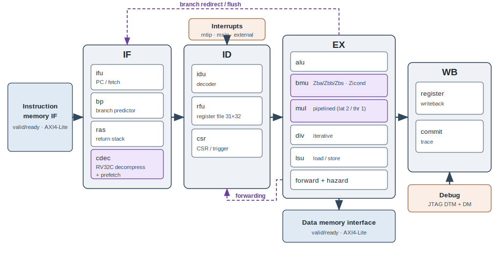
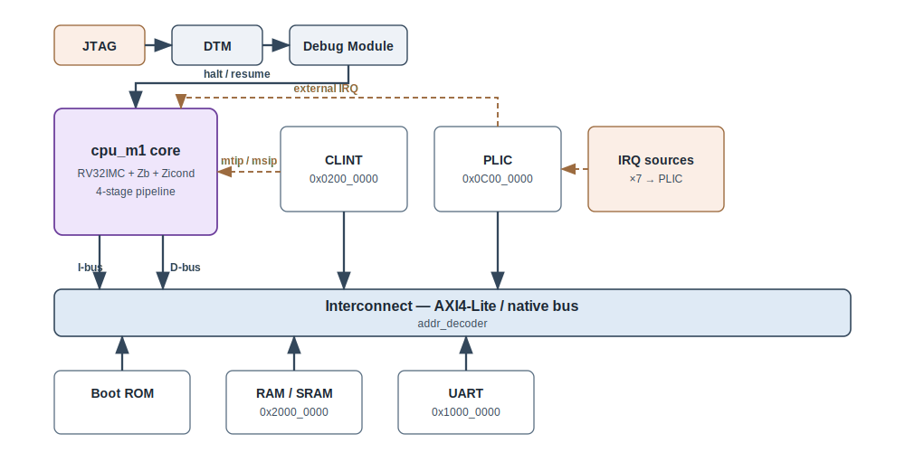

# Magpie_M1A

Magpie_M1A is a small 32-bit RISC-V CPU core (**RV32IMC + Zba/Zbb/Zbs + Zicond**) written in
Verilog. The core targets embedded control and edge applications: it has a 4-stage in-order
pipeline, a native `valid/ready` bus with an optional AXI4-Lite wrapper, and M-mode privilege with
optional PMP. It is verified against the Spike instruction-set simulator by per-commit lockstep.

<p align="center"></p>

The pipeline fetches through a branch predictor, return-address stack and RV32C decompressor with
cross-boundary prefetch (**IF**); decodes and reads the 31×32 register file and CSRs (**ID**);
executes on the ALU, bit-manipulation unit, pipelined multiplier, iterative divider and load/store
unit with full forwarding and hazard interlocks (**EX**); and retires with an architectural commit
trace used for lockstep (**WB**).

## Supported Instruction Sets

| Extension | Status | Notes |
| --------- | ------ | ----- |
| RV32I | ✔ | Base integer instruction set |
| RV32M | ✔ | Pipelined multiply (latency 2 / throughput 1), iterative divide |
| RV32C | ✔ | Compressed instructions, cross-boundary prefetch |
| Zba / Zbb / Zbs | ✔ | Address generation, basic bit-manipulation, single-bit ops (`bmu`) |
| Zicond | ✔ | Conditional zero (`czero.eqz` / `czero.nez`) |
| Zicsr / Zifencei | ✔ | M-mode CSRs, `fence.i` |
| PMP | optional | Physical memory protection regions |
| Privilege | M-mode | Machine mode only |

## Configuration

Magpie_M1A is delivered as a single fixed configuration.

| | Magpie_M1A |
| --- | --- |
| Features | RV32IMC + Zba/Zbb/Zbs + Zicond, 4-stage, BP + RAS, pipelined mult (2/1) |
| Performance (CoreMark/MHz) | 3.23 <sup>1</sup> |
| Frequency | ~700 MHz <sup>2</sup> |
| Area (kGE) | ≈80.7 <sup>2</sup> |
| Power | ~14 mW <sup>2</sup> |
| Verification status | Green <sup>3</sup> |

1. CoreMark compiled at `-O3`; result is cycles-per-CoreMark measured in simulation and CRC-validated.
2. Synthesis **trial** (indicative, not production sign-off) on a 28 nm process. kGE = NAND2-equivalent
   gate count; excludes the dual-bank TCM SRAM macro.
3. Green indicates verification is close to complete: Spike per-commit lockstep, riscv-arch-test
   74/74 (IMC), and line coverage 100%. The Zb extensions have no ratified architectural-test suite
   and are covered by directed tests + instruction injection.

## System integration

The core exposes a native `valid/ready` bus, or AXI4-Lite masters (`M_AXI_I` / `M_AXI_D`) via the
wrapper. A reference SoC (`rtl/soc/`) attaches CLINT, PLIC, UART and memory through an address
decoder, plus a JTAG-driven Debug Module.

<p align="center"></p>

| Region | Base address |
| --- | --- |
| RAM / SRAM | `0x2000_0000` |
| CLINT (timer / software IRQ) | `0x0200_0000` |
| PLIC (external IRQ, 7 sources) | `0x0C00_0000` |
| UART | `0x1000_0000` |

## Top-level modules

| Module | Interface | Use when |
| --- | --- | --- |
| `cpu_m1_top` | Native `valid/ready` Harvard I/D | Tightly-coupled memory or a custom bus fabric |
| `cpu_m1_axil_top` | AXI4-Lite master (`M_AXI_I` / `M_AXI_D`) | Standard AXI SoC interconnect |
| `cpu_m1_soc_top` | Reference SoC (core + CLINT/PLIC/UART/DM) | Bring-up / evaluation |

Key `cpu_m1_top` ports: `clk`, `resetn`, `trap`, `ibus_{req,addr,ready,rdata}`,
`dbus_{req,addr,we,wstrb,wdata,ready,rdata}`, `irq_external_pulse`, `mtip`, `msip`. The reset
vector is the `RESET_PC` parameter (default `0`). Both busses are single-outstanding and
ready-gated: hold `*_req` until `*_ready`; read data returns on the cycle after `*_ready`.

## Getting started

Lint / elaborate the RTL with Verilator (run from the repository root):

```bash
verilator --lint-only -Wall -f rtl/filelist.f --top-module cpu_m1_top
```

Build and run a self-checking unit testbench:

```bash
cd sim && make verilator TB=tb_alu_unit      # prints: PASS: alu unit 382/382 vectors
```

Instantiate the core:

```verilog
cpu_m1_top #(.RESET_PC(32'h0000_0000)) u_cpu (
    .clk(clk), .resetn(resetn), .trap(trap),
    .ibus_req(ibus_req), .ibus_addr(ibus_addr),
    .ibus_ready(ibus_ready), .ibus_rdata(ibus_rdata),
    .dbus_req(dbus_req), .dbus_addr(dbus_addr), .dbus_we(dbus_we),
    .dbus_wstrb(dbus_wstrb), .dbus_wdata(dbus_wdata),
    .dbus_ready(dbus_ready), .dbus_rdata(dbus_rdata),
    .irq_external_pulse(irq_ext), .mtip(mtip), .msip(msip)
);
```

## Verification

Correctness is established against the Spike ISS by per-commit lockstep, plus a directed and
random test suite (riscv-arch-test 74/74 for IMC, line coverage 100%). Verification IP lives in
[`dv/`](dv), run scripts in [`sim/`](sim), block-level proofs in [`formal/`](formal), and lint /
CDC / RDC setup in [`lint/`](lint). Code-coverage results (line 100% in-SKU effective) are
summarised in [`docs/coverage.md`](docs/coverage.md). The self-checking unit testbenches run
standalone under Verilator or VCS; the full Spike lockstep / riscv-dv toolchain is not included in
this release.

## Directory structure

The repository is organised by flow stage, each directory with its own README.

```
Magpie_M1A/
├── rtl/       Synthesizable core RTL + reference SoC (soc/) + filelist
├── dv/        Verification IP: testbenches, directed tests, coverage, vplan
├── sim/       Simulation runner — Verilator (OSS) and Synopsys VCS (licensed)
├── lint/      RTL lint / CDC / RDC — Verilator + Synopsys Spyglass
├── syn/       ASIC synthesis — Synopsys Design Compiler, TSMC 28 nm
├── formal/    Formal property verification — SymbiYosys / Verilator
├── fpga/      FPGA build — Xilinx Vivado, PYNQ-Z2
├── docs/      Micro-architecture spec + block diagrams
└── ip.json    Machine-readable IP manifest
```

| Flow | Tools |
| --- | --- |
| Simulation | Verilator · Synopsys VCS |
| Lint / CDC / RDC | Verilator · Synopsys Spyglass |
| Synthesis | Synopsys Design Compiler (TSMC 28 nm) |
| Formal | SymbiYosys · Verilator |
| FPGA | Xilinx Vivado (PYNQ-Z2) |

## Documentation

| Document | Contents |
| --- | --- |
| [`docs/microarchitecture.md`](docs/microarchitecture.md) | Pipeline / micro-architecture specification |
| [`docs/coverage.md`](docs/coverage.md) | Code-coverage report (raw + in-SKU effective) |
| [`ip.json`](ip.json) | Machine-readable IP manifest (ISA, interfaces, package) |
